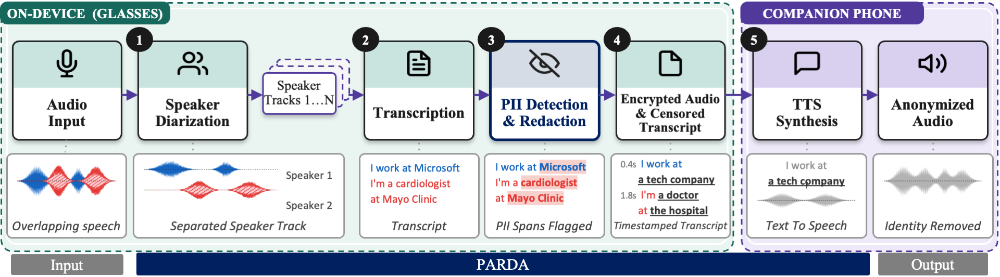
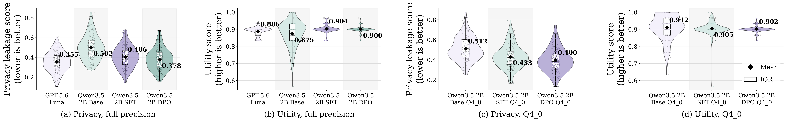
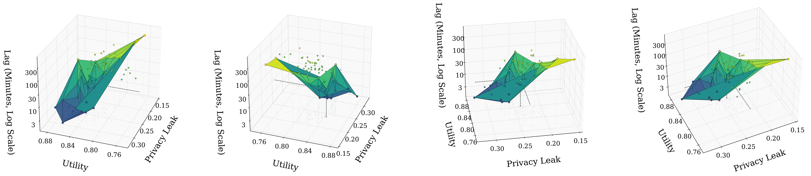
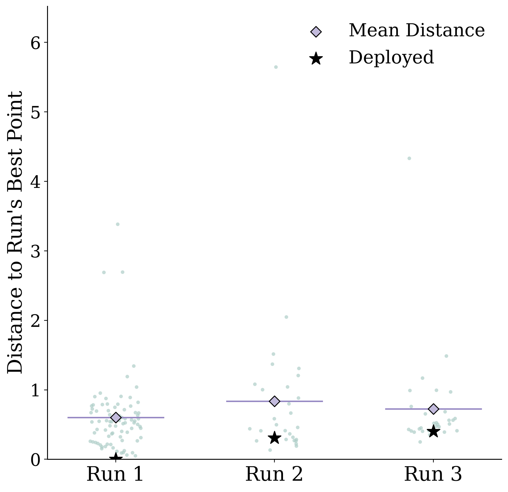
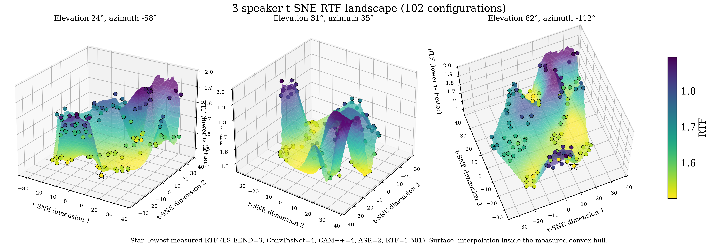
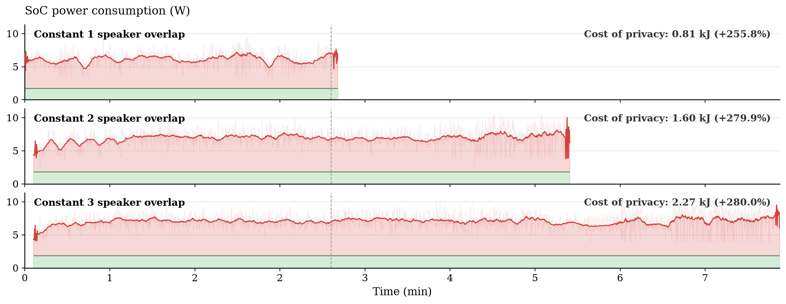

# PARDA

**On-Device Audio Privacy for Smart Glasses using Small Language Models**

PARDA protects both how a bystander sounds and what their conversation reveals. It performs streaming speaker-aware transcription on the glasses, maintains causal privacy state across bounded windows, rewrites private disclosures with a small language model, and supports non-source speech resynthesis and consent-gated restoration.

This anonymous artifact accompanies a PerCom submission. It contains the runtime, model preparation scripts, 717 parsed silver-label sets, paper results, and supplementary figures. CANDOR recordings and transcripts, trained model weights, API credentials, and raw model requests are not distributed.

## System pipeline



Audio stays inside the glasses trust boundary through diarization, transcription, causal privacy detection, redaction, and encryption. The companion phone receives the protected transcript and produces non-source speech.

## Results at a glance

| Result | Value |
| --- | ---: |
| Silver-labeled conversations | 717 |
| Paper split | 515 train / 59 validation / 143 test |
| DPO leakage / utility, full precision | 0.378 / 0.900 |
| DPO leakage / utility, Q4_0 | 0.400 / 0.902 |
| Weighted audio-path RTF | 0.7703 |
| End-to-end replay runs | 40 |
| Mean transcription delay | 23.56 s |
| Mean SLM drain lag | 6.43 min |



## Additional results beyond the paper

The artifact includes analyses that could not fit in the paper. The 3D teacher search exposes the privacy–utility–latency frontier across validation runs, while the distance plot shows how consistently the deployed configuration remains near each run's own optimum.

<p align="center">
  
</p>

<p align="center">
  
</p>

<p align="center">
  
</p>

The Raspberry Pi power traces below show the measured SoC cost of continuous one-, two-, and three-speaker stress workloads. Green marks idle SoC power; red shows the incremental privacy pipeline load.

<p align="center">
  
</p>

The full gallery also includes the one- and two-speaker scheduling landscapes, temperature sweep, component Pareto plots, ablations, and end-to-end latency waterfall.

## Repository map

| Path | Contents |
| --- | --- |
| [`src/parda/anonymization`](src/parda/anonymization) | Causal adversary/anonymizer runtime, retrieval, validation, and exact prompts |
| [`src/parda/audio`](src/parda/audio) | LS-EEND, separation, speaker association, and Moonshine streaming pipeline |
| [`src/parda/cryptography`](src/parda/cryptography) | Track protection and consent-gated restoration utilities |
| [`dataset`](dataset) | Data card, CANDOR conversion instructions, split manifests, and parsed labels |
| [`scripts/models`](scripts/models) | Download and deployment optimization scripts; no weights are included |
| [`benchmarks`](benchmarks) | Measurement definitions and reported configurations |
| [`figures`](figures) | Paper and supplementary figure gallery |

## Quick start

```bash
python3 -m venv .venv
source .venv/bin/activate
pip install -e .

python src/parda/anonymization/run.py \
  --transcript examples/synthetic_conversation.txt \
  --backend openrouter \
  --model YOUR_MODEL \
  --window-lines 12 --passes-per-window 1 \
  --rag-top-k 8 --rag-threshold 0.774
```

For local deployment, start a llama.cpp server with your own trained or compatible model and select the `llama.cpp` backend. The exact paper configuration is recorded in [`configs/paper.json`](configs/paper.json). See [`models/README.md`](models/README.md) for model acquisition and optimization.

## Dataset

PARDA uses CANDOR but does not redistribute it. After obtaining CANDOR under its own terms:

```bash
python scripts/convert_candor.py \
  --candor-root dataset/candor_raw \
  --output dataset/processed
python scripts/validate_dataset.py
```

The 143 held-out test IDs are verified. The original 515/59 train/validation membership is being recovered from frozen training artifacts, so those 574 labels are currently marked `pending` rather than being randomly reassigned. See the [`dataset` documentation](dataset/README.md).

## Figures and benchmarks

The paper figures and additional 3D teacher-search, distance-from-best, speaker-count power, temperature, and t-SNE figures are collected in [`figures/README.md`](figures/README.md). Benchmark scripts distinguish paced replay, forced-speaker saturation, and concurrent SLM contention.

## Reproducibility boundaries

- No trained weights are stored in Git. Download/conversion/optimization scripts and expected local paths are provided.
- The released annotations are model-generated silver labels. Evidence references use CANDOR line numbers.
- Forced-speaker scheduling searches are saturation tests; they are not semi-paced deployment replays.
- The repository is anonymous and does not include the submission PDF.

## Citation and license

A citation entry will be added after acceptance. No open-source license has yet been granted; absent a license, standard copyright restrictions apply. Third-party models and CANDOR remain governed by their respective terms.
