# PARDA

**On-Device Audio Privacy for Smart Glasses using Small Language Models**

PARDA protects both how a bystander sounds and what their conversation reveals. It performs streaming speaker-aware transcription on the glasses, maintains causal privacy state across bounded windows, rewrites private disclosures with a small language model, and supports non-source speech resynthesis and consent-gated restoration.

This anonymous artifact accompanies a PerCom submission. It contains the runtime, model preparation scripts, 717 parsed silver-label sets, paper results, and supplementary figures. CANDOR recordings and transcripts, trained model weights, API credentials, and raw model requests are not distributed.

## System pipeline


Audio stays inside the glasses trust boundary through diarization, transcription, causal privacy detection, redaction, and encryption. The companion phone receives the protected transcript and produces non-source speech.

## Results at a glance

| Result | Value |
| --- | ---: |
| Silver-labeled conversations | 717 |
| Paper split | 515 train / 59 validation / 143 test |
| Weighted audio-path RTF | 0.7703 |
| End-to-end replay runs | 40 |
| Mean transcription delay | 23.56 s |
| Mean SLM drain lag | 6.43 min |

### Privacy and utility comparison

All methods were evaluated on the same 143 held-out conversations. Deltas are relative to the deployed Q4_0 PARDA model: lower leakage and higher utility are better.

| Method | Class | Leakage ↓ | Utility ↑ | Δ leakage | Δ utility |
| --- | --- | ---: | ---: | ---: | ---: |
| **PARDA DPO, Q4_0 (deployed)** | On-device SLM | **0.400** | **0.902** | — | — |
| PARDA DPO, full precision | On-device SLM | 0.378 | 0.900 | -0.022 | -0.001 |
| GPT-5.6 Luna | Large-model teacher | 0.355 | 0.886 | -0.045 | -0.015 |
| GLiNER-PII | PII baseline | 0.311 | 0.856 | -0.089 | -0.046 |
| Azure Conversation PII | PII baseline | 0.450 | 0.997 | +0.050 | +0.095 |
| Microsoft Presidio | PII baseline | 0.378 | 0.998 | -0.023 | +0.096 |

The conventional PII systems target explicit identifiers, whereas PARDA also targets linked and inferred disclosures. Their scores therefore show performance under PARDA's broader evaluation taxonomy, rather than a universal ranking of the services.

<p align="center">
  
</p>

<p align="center">
  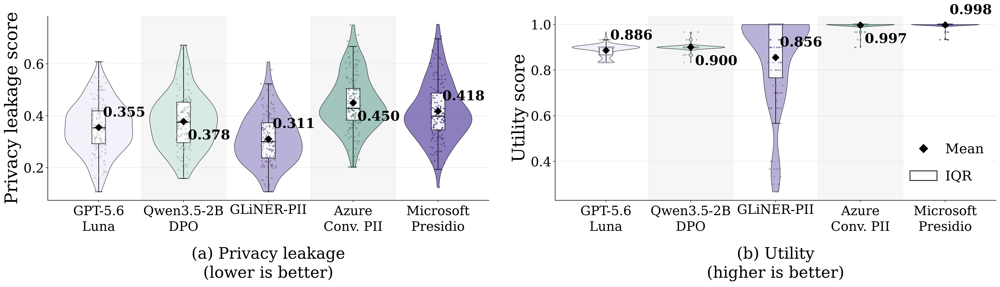
</p>

### Model and system selection

The figures below summarize the privacy-model trade-off, retrieval ablation, and deployed audio-component choices. Bold or highlighted points identify the deployed configurations.

<p align="center">
  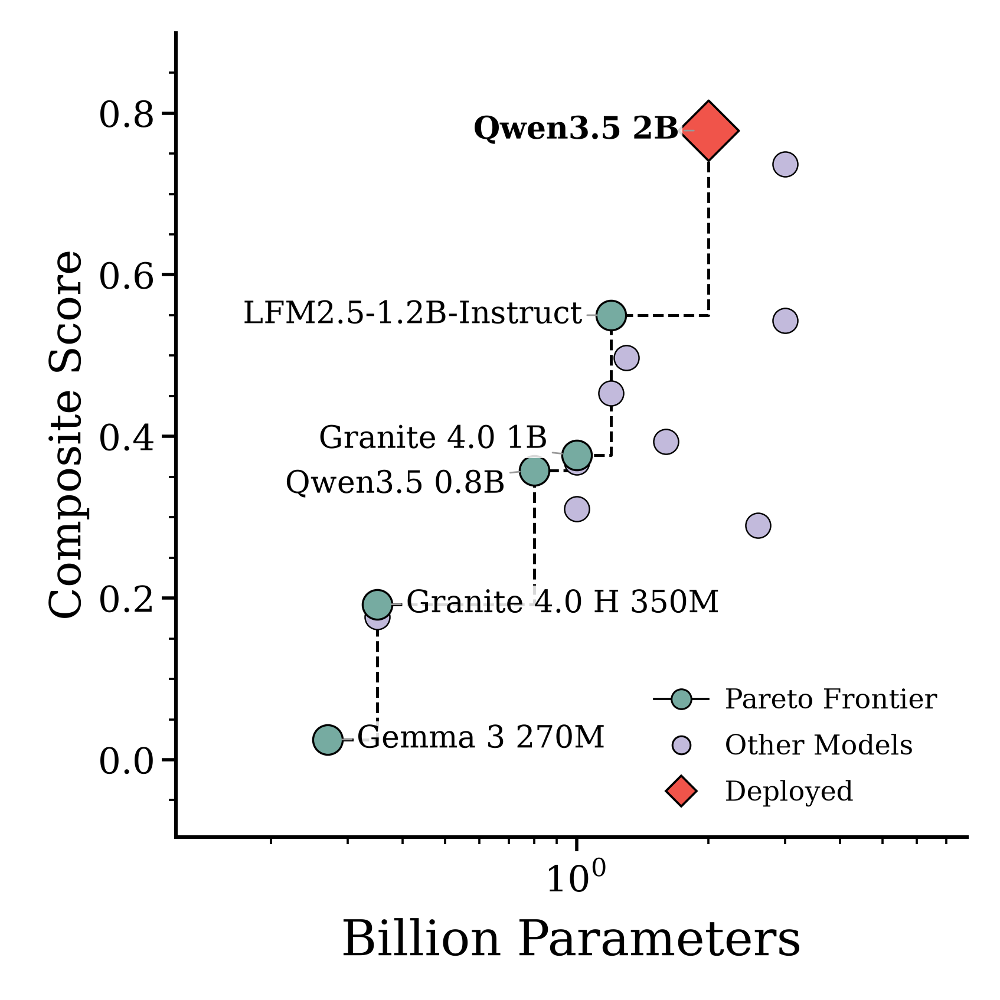
  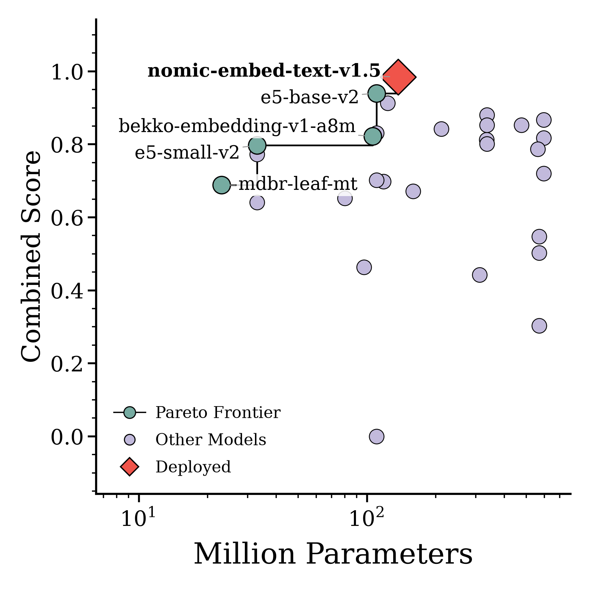
</p>

<p align="center">
  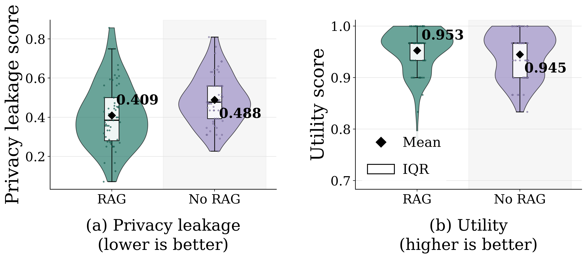
</p>

<p align="center">
  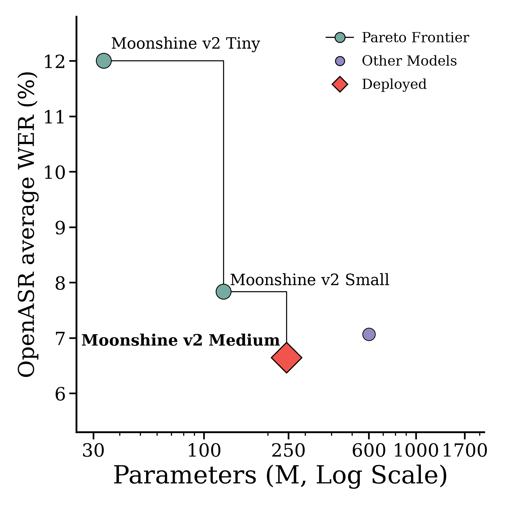
  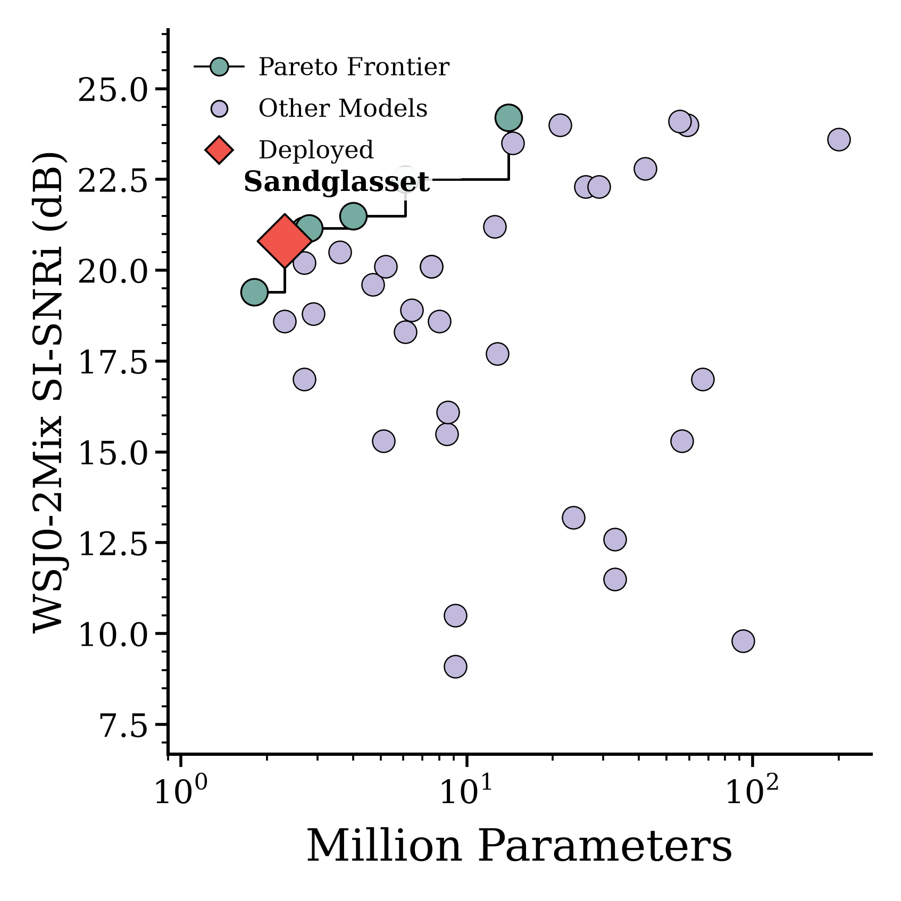
  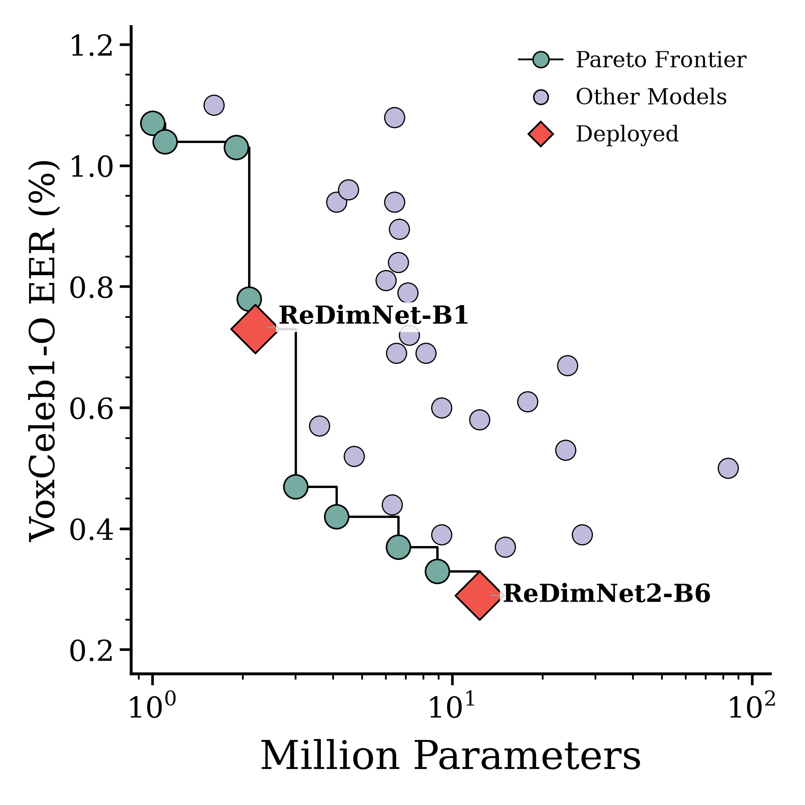
</p>

<p align="center">
  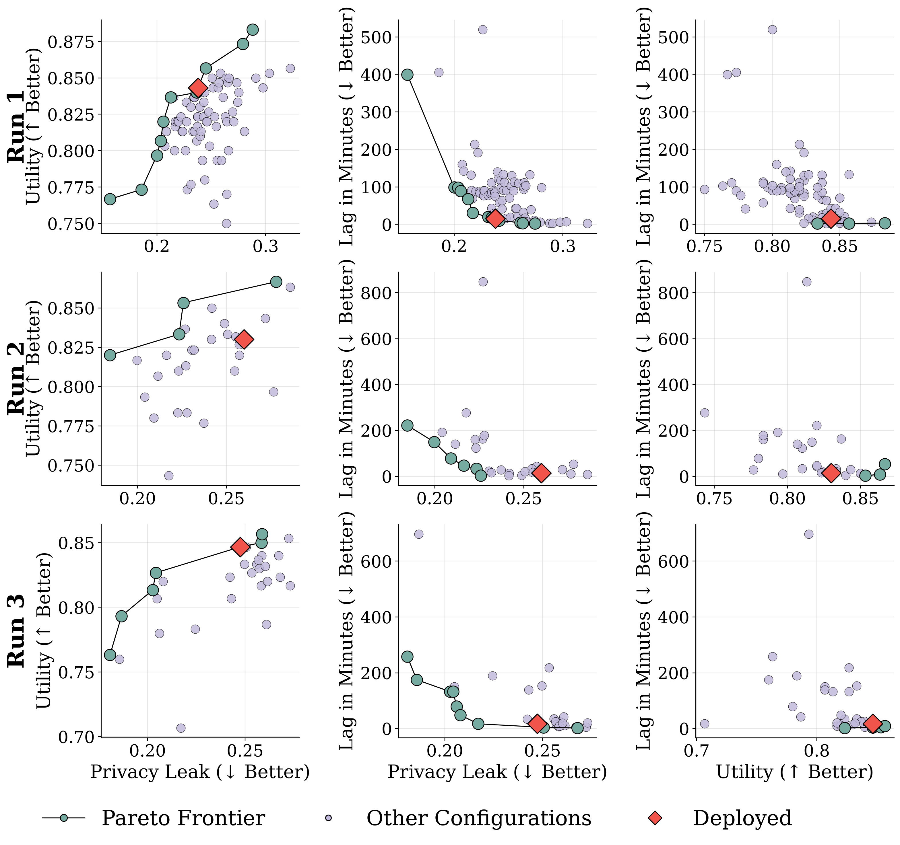
</p>

### End-to-end deployment

The measured Raspberry Pi replay combines stage execution, accumulated audio lag, SLM drain behavior, and SoC power in one timeline.

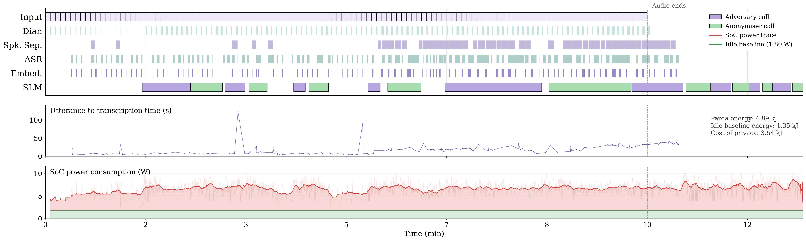

## Additional results beyond the paper

The artifact includes analyses that could not fit in the paper. The 3D teacher search exposes the privacy–utility–latency frontier across validation runs, while the distance plot shows how consistently the deployed configuration remains near each run's own optimum.

<p align="center">
  
</p>

<p align="center">
  
</p>

Scheduling searches for one, two, and three speakers show the measured real-time-factor landscape around the selected cohort allocations.

<p align="center">
  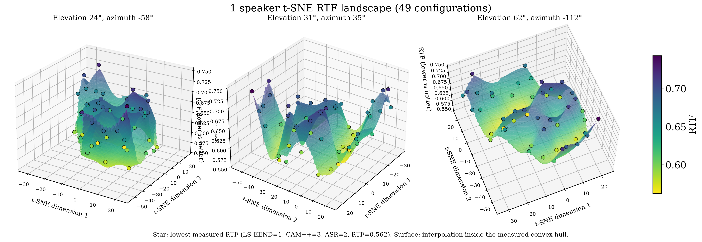
</p>

<p align="center">
  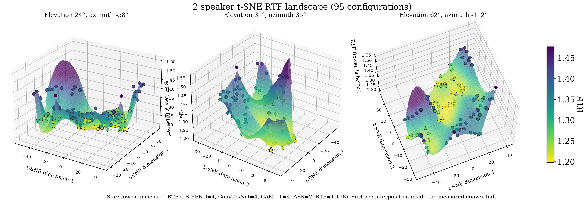
</p>

<p align="center">
  
</p>

The temperature sweep tests operating-point stability. The Raspberry Pi power traces show the measured SoC cost of continuous one-, two-, and three-speaker stress workloads; green marks idle SoC power and red marks incremental pipeline load.

<p align="center">
  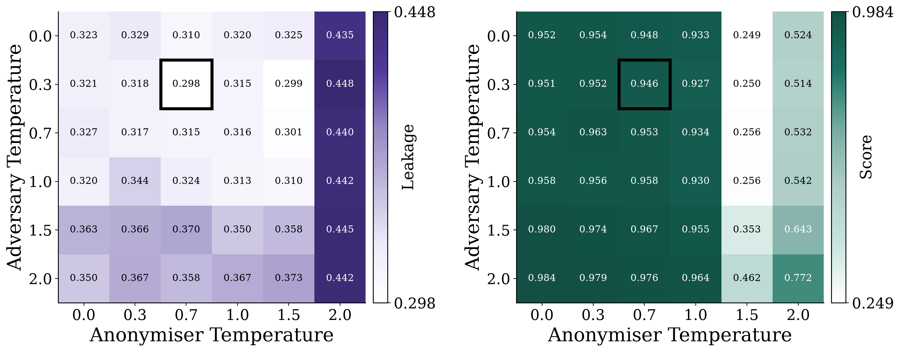
</p>

<p align="center">
  
</p>

Every figure is also linked individually in the [figure gallery](figures/README.md).

## Repository map

| Path | Contents |
| --- | --- |
| [`src/parda/anonymization`](src/parda/anonymization) | Causal adversary/anonymizer runtime, retrieval, validation, and exact prompts |
| [`src/parda/audio`](src/parda/audio) | LS-EEND, separation, speaker association, and Moonshine streaming pipeline |
| [`src/parda/cryptography`](src/parda/cryptography) | Track protection and consent-gated restoration utilities |
| [`dataset`](dataset) | Data card, CANDOR conversion instructions, split manifests, and parsed labels |
| [`scripts/models`](scripts/models) | Download and deployment optimization scripts; no weights are included |
| [`benchmarks`](benchmarks) | Measurement definitions and reported configurations |
| [`figures`](figures) | Paper and supplementary figure gallery |

## Quick start

```bash
python3 -m venv .venv
source .venv/bin/activate
pip install -e .

python src/parda/anonymization/run.py \
  --transcript examples/synthetic_conversation.txt \
  --backend openrouter \
  --model YOUR_MODEL \
  --window-lines 12 --passes-per-window 1 \
  --rag-top-k 8 --rag-threshold 0.774
```

For local deployment, start a llama.cpp server with your own trained or compatible model and select the `llama.cpp` backend. The exact paper configuration is recorded in [`configs/paper.json`](configs/paper.json). See [`models/README.md`](models/README.md) for model acquisition and optimization.

## Dataset

PARDA uses CANDOR but does not redistribute it. After obtaining CANDOR under its own terms:

```bash
python scripts/convert_candor.py \
  --candor-root dataset/candor_raw \
  --output dataset/processed
python scripts/validate_dataset.py
```

The 143 held-out test IDs are verified. The original 515/59 train/validation membership is being recovered from frozen training artifacts, so those 574 labels are currently marked `pending` rather than being randomly reassigned. See the [`dataset` documentation](dataset/README.md).

## Figures and benchmarks

The paper figures and additional 3D teacher-search, distance-from-best, speaker-count power, temperature, and t-SNE figures are collected in [`figures/README.md`](figures/README.md). Benchmark scripts distinguish paced replay, forced-speaker saturation, and concurrent SLM contention.

## Reproducibility boundaries

- No trained weights are stored in Git. Download/conversion/optimization scripts and expected local paths are provided.
- The released annotations are model-generated silver labels. Evidence references use CANDOR line numbers.
- Forced-speaker scheduling searches are saturation tests; they are not semi-paced deployment replays.
- The repository is anonymous and does not include the submission PDF.

## Citation and license

A citation entry will be added after acceptance. No open-source license has yet been granted; absent a license, standard copyright restrictions apply. Third-party models and CANDOR remain governed by their respective terms.
